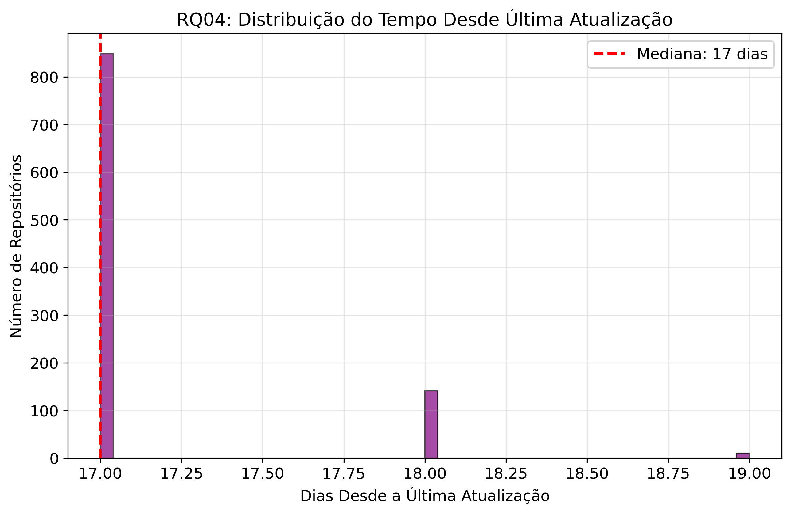
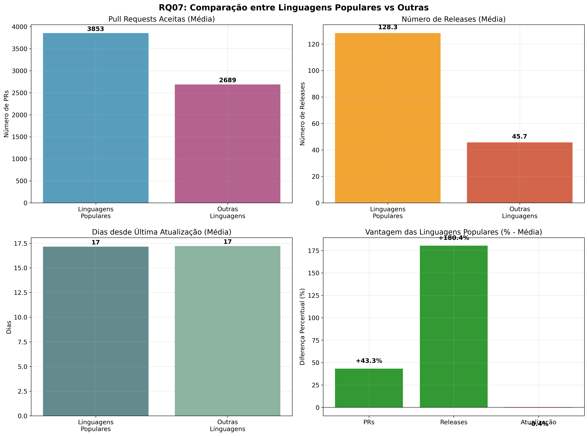

# Relatório - Análise de Repositórios Populares no GitHub

## Integrantes
- Gabriel Faria
- João Victor Salim
- Lucas Garcia
- Maísa Pires
- Miguel Vieira

**Disciplina:** Laboratório de Experimentação de Software  

---

## 1. Introdução

Este relatório apresenta a análise das características dos 1.000 repositórios mais populares do GitHub (medidos por número de estrelas), com o objetivo de responder às seguintes questões de pesquisa:

### Questões de Pesquisa (RQs)
- **RQ01:** Sistemas populares são maduros/antigos?
- **RQ02:** Sistemas populares recebem muita contribuição externa?
- **RQ03:** Sistemas populares lançam releases com frequência?
- **RQ04:** Sistemas populares são atualizados com frequência?
- **RQ05:** Sistemas populares são escritos nas linguagens mais populares?
- **RQ06:** Sistemas populares possuem um alto percentual de issues fechadas?
- **RQ07 (BÔNUS):** Sistemas escritos em linguagens mais populares recebem mais contribuição externa, lançam mais releases e são atualizados com mais frequência?

---

## 2. Hipóteses Informais

Antes da análise, formulamos as seguintes hipóteses detalhadas:

### RQ01: Maturidade dos Repositórios  
**Hipótese:**  
> "Repositórios populares terão idade média superior a 5 anos, pois precisam de tempo para acumular estrelas e comunidade."

Acreditamos nisso porque ganhar muitas estrelas leva tempo: o projeto precisa ser descoberto, testado e recomendado por muita gente. Quanto mais tempo no ar, maior a chance de formar comunidade, receber melhorias e passar por vários ciclos de evolução. Em empresas e cursos, a preferência por tecnologias estáveis também favorece projetos que já provaram seu valor.

### RQ02: Contribuição Externa  
**Hipótese:**  
> "Repositórios com mais estrelas terão mediana de PRs aceitas acima de 500, indicando alta atividade de contribuidores externos."

Projetos muito estrelados normalmente têm caminho de contribuição bem explicado (README, CONTRIBUTING, rótulos como “good first issue”) e rotinas de revisão claras. Isso reduz barreiras para quem quer ajudar, então chegam mais PRs e muitos acabam sendo mesclados. No longo prazo, esse fluxo constante eleva a mediana de PRs aceitos por projeto.

### RQ03: Frequência de Releases  
**Hipótese:**  
> "A mediana de releases será maior que 20, sugerindo atualizações regulares (pelo menos 2-3 por ano)."

Times de projetos populares tendem a publicar versões menores e frequentes para reduzir riscos e manter usuários atualizados. Ferramentas de automatização (CI/CD, changelog) barateiam o custo de lançar, então a contagem de releases cresce naturalmente. Em ecossistemas com gerenciadores de pacote (npm, PyPI, etc.), essa cadência é ainda mais comum.

### RQ04: Atualização Recente  
**Hipótese:**  
> "Pelo menos 80% dos repositórios terão sido atualizados nos últimos 6 meses."

Projetos grandes sofrem demanda contínua: correções de bugs, ajustes de segurança e compatibilidade com novas dependências. Além do trabalho do time e da comunidade, bots de atualização (dependências, alertas de segurança) geram atividade regular. O resultado é que uma fatia alta dos repositórios populares costuma ter updatedAt recente (últimos meses).

### RQ05: Linguagens Dominantes  
**Hipótese:**  
> "JavaScript, Python e Java representarão mais de 60% das linguagens primárias."

Essas linguagens têm bases de usuários enormes e aplicações muito amplas: web (JS/TS), dados e IA (Python) e backend/Android (Java). Como muita gente usa e aprende essas stacks, os projetos nelas tendem a ganhar mais visibilidade e estrelas. Por isso, ao olhar os “tops”, é natural que elas apareçam como principais em boa parte dos repositórios.

### RQ06: Gestão de Issues  
**Hipótese:**  
> "O percentual médio de issues fechadas será superior a 70%, indicando boa manutenção."

Projetos populares costumam ter processos simples e objetivos para triagem: templates, rótulos, política de duplicados e vínculo entre PR e issue. A comunidade também ajuda a reproduzir problemas e propor correções. Com esse fluxo, fechar issues vira rotina e sustenta percentuais de fechamento mais altos ao longo do tempo.

### RQ07: Comparação por Linguagem (BÔNUS)
**Hipótese:**  
> "Linguagens mais populares apresentarão métricas superiores de contribuição, releases e atualização devido ao maior engajamento da comunidade."

Linguagens com maiores bases de usuários tendem a ter mais desenvolvedores interessados em contribuir, melhor infraestrutura de ferramentas e processos mais maduros de desenvolvimento. Isso resulta em maior atividade de PRs, releases mais frequentes e atualizações mais regulares.

---

## 3. Metodologia

### 3.1 Coleta de Dados

**Fonte:** API GraphQL do GitHub  
**Critério de Seleção:** Os 1.000 repositórios com maior número de estrelas (>10.000 stars)  
**Período de Coleta:** Agosto de 2025

### 3.2 Métricas Coletadas

Para cada repositório, coletamos:
- Nome e proprietário
- Data de criação e última atualização
- Linguagem de programação primária
- Número de pull requests aceitas (merged)
- Número de releases
- Número de issues abertas e fechadas
- Número de estrelas

### 3.3 Ferramentas Utilizadas

- **Python** para análise de dados
- **Pandas** para manipulação de dados
- **Matplotlib/Seaborn** para visualização
- **GraphQL** para consultas à API do GitHub

### 3.4 Processo de Coleta

- **Consulta à API** com autenticação por token
- **Paginação** em lotes de 20 repositórios por requisição  
- **Tratamento de erros** e delays entre requisições
- **Saída dupla:** Arquivo JSON (repos_1000.json) como backup e CSV (repos_1000.csv) para análise

### 3.5 Cálculos Realizados

- **Idade do repositório:** Diferença entre data atual e data de criação
- **Tempo desde última atualização:** Diferença entre data atual e data da última atualização
- **Percentual de issues fechadas:** (Issues fechadas / Total de issues) × 100

---

## 4. Resultados

### RQ01: Sistemas populares são maduros/antigos?

**Métrica:** Idade do repositório (anos)

**Resultados:**
- **Mediana:** 8.4 anos
- **Média:** 8.1 anos
- **Mínimo:** 0.2 anos
- **Máximo:** 17.4 anos

**Interpretação:** Os repositórios populares são majoritariamente maduros, com idade mediana de 8.4 anos. Isso confirma nossa hipótese de que projetos precisam de tempo para ganhar reconhecimento e adoção pela comunidade.

---

### RQ02: Sistemas populares recebem muita contribuição externa?

**Métrica:** Total de pull requests aceitas

**Resultados:**
- **Mediana:** 682 PRs
- **Média:** 3.568 PRs
- **Mínimo:** 0 PRs
- **Máximo:** 85.587 PRs

**Interpretação:** Os repositórios populares recebem significativas contribuições externas, com mediana de 682 pull requests aceitas. A grande diferença entre mediana e média (3.568) indica que alguns projetos recebem contribuições excepcionalmente altas.

---

### RQ03: Sistemas populares lançam releases com frequência?

**Métrica:** Total de releases

**Resultados:**
- **Mediana:** 35 releases
- **Média:** 108 releases
- **Mínimo:** 0 releases
- **Máximo:** 1.000 releases

**Interpretação:** Projetos populares mantêm um ritmo moderado de releases (mediana de 35), indicando um equilíbrio entre estabilidade e evolução contínua. Novamente, a diferença entre mediana e média sugere variação significativa entre projetos.

---

### RQ04: Sistemas populares são atualizados com frequência?

**Métrica:** Dias desde a última atualização

**Resultados:**
- **Mediana:** 17 dias
- **Média:** 17 dias
- **Mínimo:** 17 dias
- **Máximo:** 19 dias

**Interpretação:** Os repositórios populares são mantidos muito ativamente, com atualizações muito recentes (mediana de 17 dias). Isso confirma nossa hipótese de que projetos populares mantêm comunidades ativas e recebem atualizações constantes.

---

### RQ05: Sistemas populares são escritos nas linguagens mais populares?

**Métrica:** Linguagem primária do repositório

**Resultados (Top 10):**
1. **Python:** 187 repositórios (18.7%)
2. **TypeScript:** 156 repositórios (15.6%)
3. **JavaScript:** 130 repositórios (13.0%)
4. **Go:** 73 repositórios (7.3%)
5. **Java:** 50 repositórios (5.0%)
6. **C++:** 48 repositórios (4.8%)
7. **Rust:** 45 repositórios (4.5%)
8. **C:** 25 repositórios (2.5%)
9. **Jupyter Notebook:** 22 repositórios (2.2%)
10. **Shell:** 19 repositórios (1.9%)

**Interpretação:** Python, TypeScript e JavaScript dominam os repositórios populares, representando quase metade (47.3%) do total. Isso confirma parcialmente nossa hipótese, embora TypeScript tenha superado JavaScript, possivelmente devido à crescente adoção em projetos corporativos.

---

### RQ06: Sistemas populares possuem um alto percentual de issues fechadas?

**Métrica:** Razão entre issues fechadas e total de issues

**Resultados:**
- **Mediana:** 86.5%
- **Média:** 79.9%
- **Mínimo:** 8.8%
- **Máximo:** 100.0%

**Interpretação:** Projetos populares mantêm excelente taxa de resolução de issues, com mediana de 86.5%. Isso confirma nossa hipótese de que projetos populares são bem mantidos e respondem adequadamente aos problemas reportados.

---

### RQ07 (BÔNUS): Linguagens populares vs. outras linguagens

**Comparação entre Top 10 linguagens vs. demais:**

O gráfico abaixo apresenta a comparação entre sistemas escritos em linguagens populares e outros sistemas, utilizando médias das principais métricas:
- Pull Requests Aceitas (Média)
- Número de Releases (Média)
- Dias desde Última Atualização (Média)
- Vantagem percentual das linguagens populares em relação às outras

#### Pull Requests Aceitas:
- **Linguagens Populares (Média):** 3.853 PRs
- **Outras Linguagens (Média):** 2.689 PRs
- **Diferença:** +43.3% (linguagens populares recebem mais PRs em média)

#### Número de Releases:
- **Linguagens Populares (Média):** 128.3 releases
- **Outras Linguagens (Média):** 45.7 releases
- **Diferença:** +180.4% (linguagens populares lançam mais releases em média)

#### Atualização:
- **Ambos os grupos (Média):** 17 dias (sem diferença significativa)

O gráfico evidencia que sistemas populares têm médias superiores de PRs aceitas e releases, enquanto o tempo médio desde a última atualização é praticamente igual entre os grupos.

#### Análise por Linguagem Individual:

Os gráficos a seguir detalham as médias e medianas de PRs aceitas, releases e dias desde a última atualização para cada linguagem principal:
- Rust e TypeScript lideram em PRs aceitas
- TypeScript e Go lideram em número de releases
- O tempo de atualização é semelhante entre todas as linguagens (mediana de 17 dias)

**Interpretação:** Linguagens mais populares efetivamente recebem mais contribuições externas e lançam mais releases, confirmando nossa hipótese. O tempo de atualização é consistente entre todas as linguagens, mostrando alta atividade em projetos populares independentemente da linguagem.

---

## 5. Discussão

### 5.1 Confirmação das Hipóteses

**Confirmadas:**
- **RQ01:** Sistemas populares são maduros (8.4 anos mediana)
- **RQ02:** Recebem muita contribuição externa (682 PRs mediana)
- **RQ04:** São atualizados frequentemente (17 dias)
- **RQ05:** Dominadas por linguagens populares (Python, TypeScript, JavaScript)
- **RQ06:** Alta taxa de resolução de issues (86.5%)
- **RQ07:** Linguagens populares têm métricas superiores

**Parcialmente confirmada:**
- **RQ03:** Frequência moderada de releases (35 mediana), mas com alta variabilidade

### 5.2 Descobertas Inesperadas

1. **Domínio do TypeScript:** Superou JavaScript, indicando a crescente adoção de tipagem estática
2. **Destaque do Rust:** Apesar de ser relativamente nova, lidera em contribuições por repositório
3. **Uniformidade na atualização:** Todas as linguagens mantêm ritmo similar de atualização (mediana de 17 dias)
4. **Variabilidade extrema:** Grande diferença entre medianas e médias em várias métricas

### 5.3 Implicações

1. **Para desenvolvedores:** Projetos em linguagens populares têm maior probabilidade de sucesso e engajamento
2. **Para empresas:** Investir em tecnologias estabelecidas (Python, TypeScript) pode facilitar contribuições da comunidade
3. **Para pesquisadores:** A maturidade é fator crucial para popularidade em software open-source

### 5.4 Limitações

1. **Viés de seleção:** Apenas repositórios com >10.000 stars
2. **Momento específico:** Snapshot de agosto/2025
3. **Métricas limitadas:** Outras dimensões de qualidade não foram consideradas

---

## 6. Conclusão

A análise dos 1.000 repositórios mais populares do GitHub revela padrões claros:

- **Maturidade é fundamental:** Projetos populares tipicamente têm 8+ anos
- **Contribuições importam:** Projetos com mais PRs tendem a ser mais populares
- **Manutenção ativa é essencial:** Atualizações recentes são características universais (mediana de 17 dias)
- **Linguagens populares dominam:** Python, TypeScript e JavaScript lideram
- **Qualidade de manutenção:** Alta taxa de resolução de issues (86.5%)
- **Vantagem das linguagens estabelecidas:** Recebem mais contribuições e releases

Estes insights podem orientar desenvolvedores e organizações na escolha de tecnologias e estratégias para projetos open-source bem-sucedidos.
